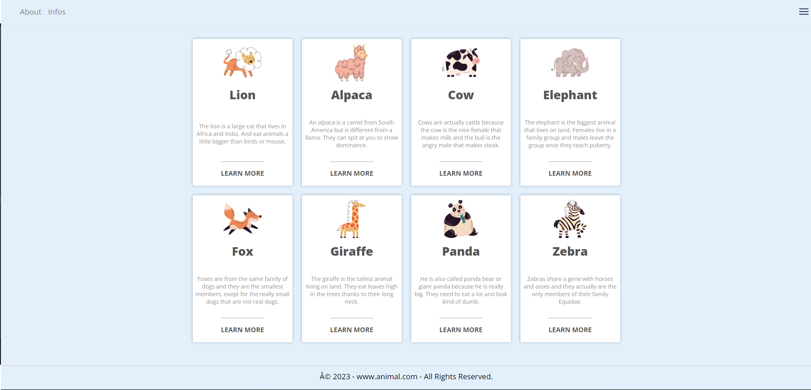

# Grid

The design department of your company sent you a new section that needs to be added to their corporate website. It is intended to show the benefits of using their services in an easy to understand way.

On desktop, the layout should have 4 columns. If possible, on tablets each row should contain 2 cards. On mobile all cards should be in one column.

## Screenshots

## Badges

## work progress

This project was made in September 2023 during a formation at BeCode.