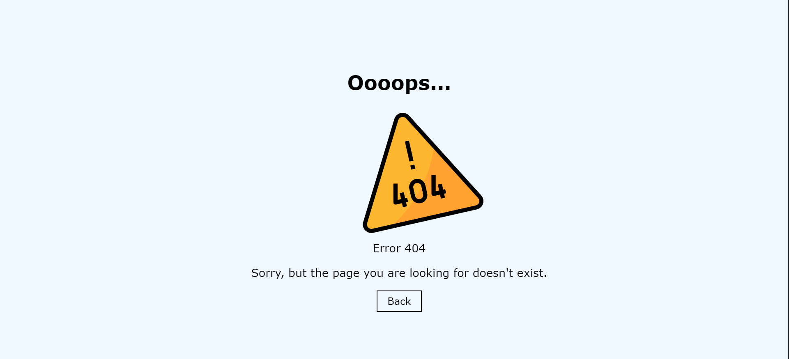

# 404 Page

You have to create a new repository called 404-page containing the HTML and CSS required for an error 404 page.

## Screenshots

## Badges

## work progress

This project was made in august 2023 during a formation at BeCode. 