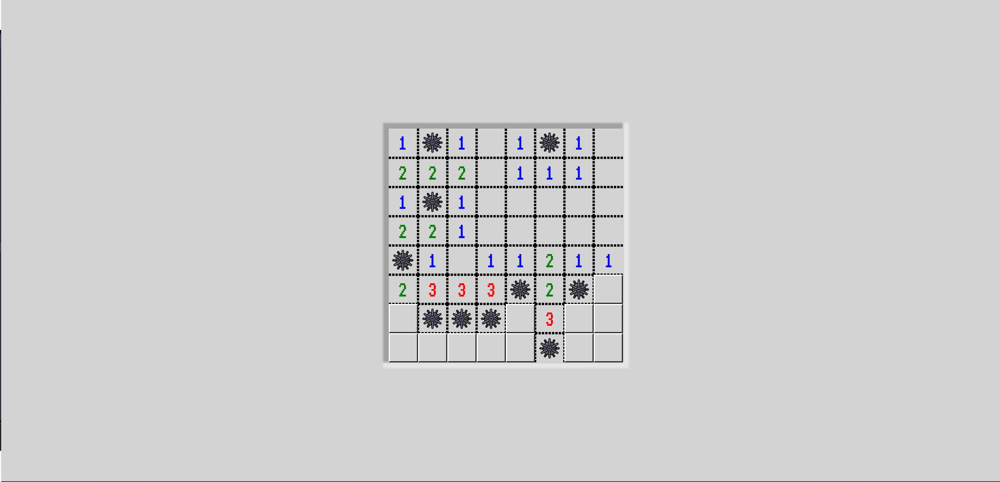

# Flexbox Minesweeper

We all remember those little games we have/had on our Windows computers. Pinball, Patience, Minesweeper, ... Well, today we are just going to make just that. A Minesweeper! But only a static moment of the game.

## Screenshots

## Badges

## work progress

This project was made in August 2023 during a formation at BeCode.