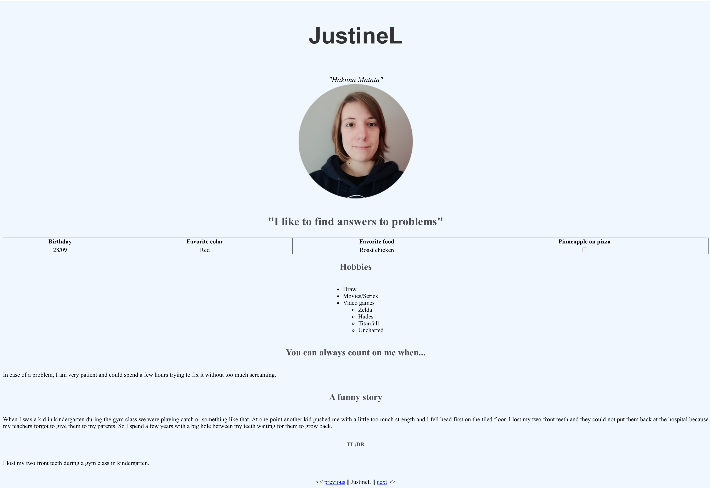

# Markdown to HTML

This is the HTML version of the mardown at the begining of this repository.

## Screenshots

## Badges

## work progress

This project was made in August 2023 during a formation at BeCode.