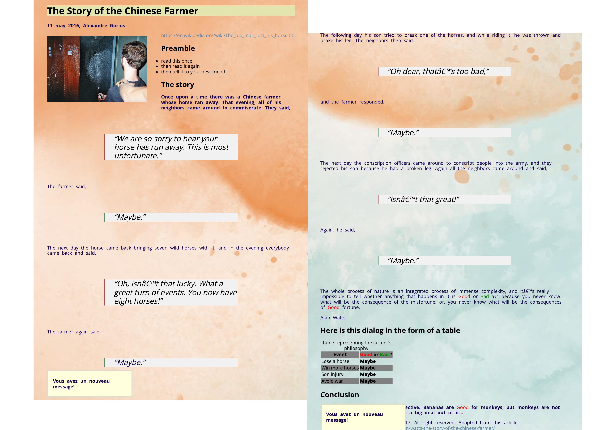

# Progressive enhancement

This is a project made to test a few different things in HTML and CSS.

## Screenshots

## Badges

## work progress

This project was made in August 2023 during a formation at BeCode. 