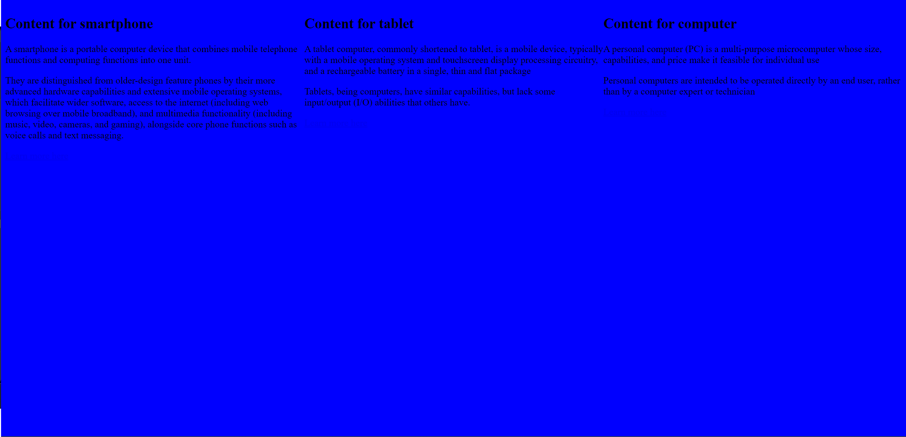
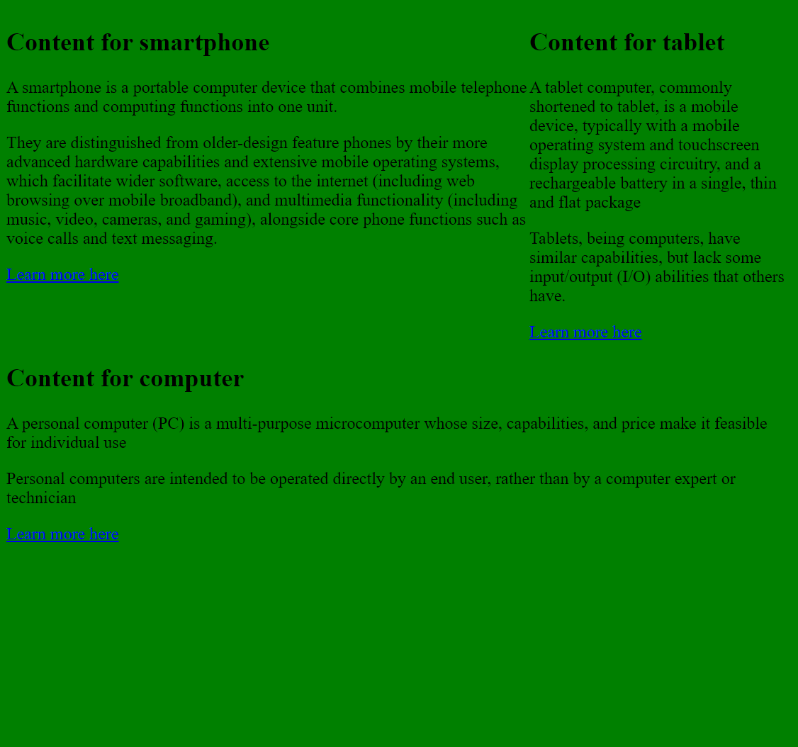
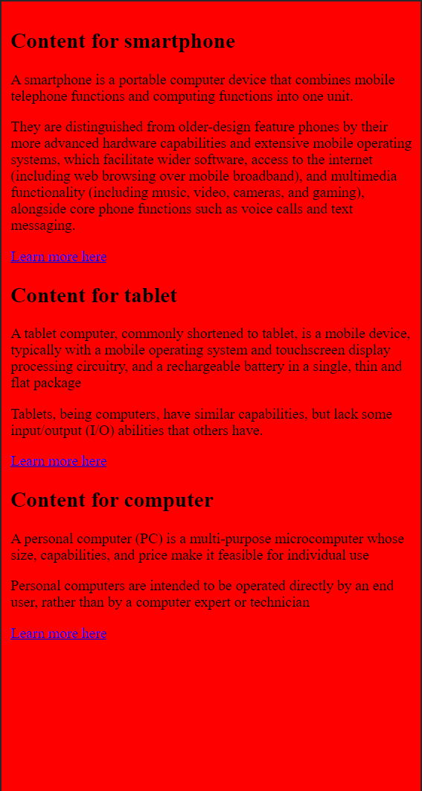

# Responsive

Create a HTML file and a CSS file. Make it so the background color of Body is red when the width of the viewport is smaller than 410px, green when the viewport width is bigger than 410px and smaller than 768px, and blue when the viewport is bigger than 768px. The arrangement of the text will also change for the three versions.

## Screenshots

## Badges

## work progress

This project was made in September 2023 during a formation at BeCode.